# 🎓 EduPlus - ERP Management System

<p align="center">


</p>

EduPlus is a complete **School ERP / School Management System** built using the **MERN Stack (MongoDB, Express.js, React.js, Node.js)**.

The project simulates a real-world school ERP used by educational institutions to manage students, teachers, attendance, fees, academic records, examinations, notices, study materials, finance, and administration through a secure role-based system.

---

## 🌐 View Live

---

### 📸 Project Preview

<p align="center">
  <a href="screenshots/dashboard.png">
    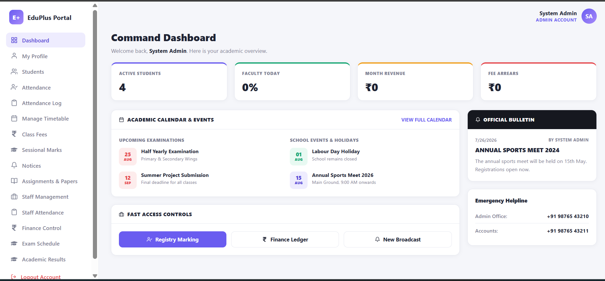
  </a>
</p>

<p align="center">
  <b>EduPlus Admin Dashboard</b>
</p>

---

### 📸 Project Screenshots

---

## 🔐 Authentication

<p align="center">
  <a href="screenshots/login-signup.png">
    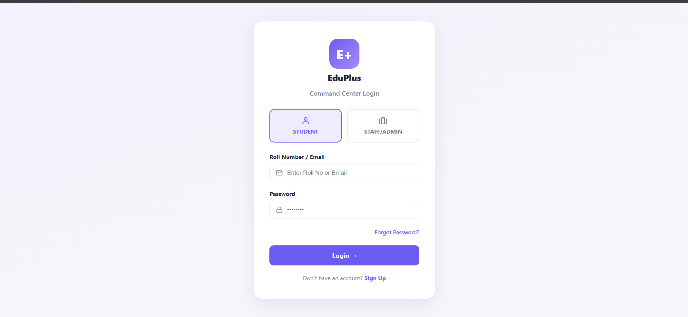
  </a>
</p>

---

## 📊 Dashboard

<p align="center">
  <a href="screenshots/dashboard.png">
    
  </a>
</p>

---

## 👨‍🎓 Student Management

<p align="center">
  <a href="screenshots/students.png">
    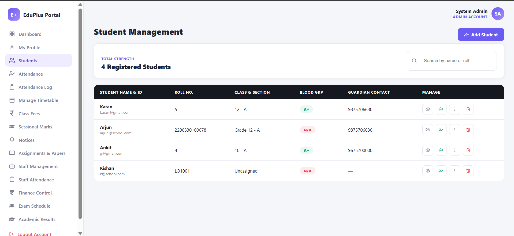
  </a>

  <a href="screenshots/admin.png">
    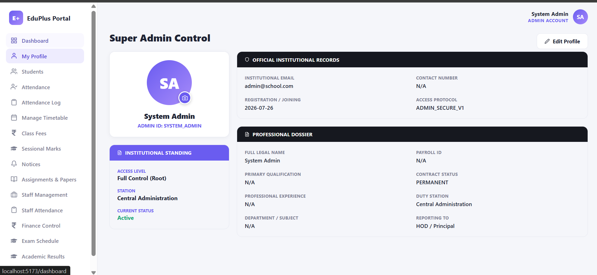
  </a>
</p>

---

## 📅 Attendance Management

<p align="center">
  <a href="screenshots/class-entry.png">
    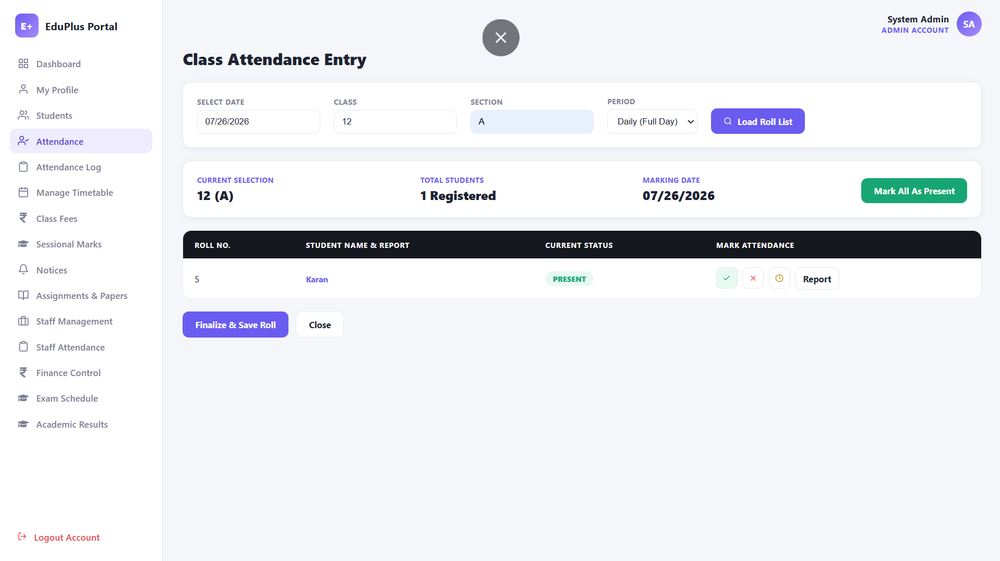
  </a>

  <a href="screenshots/attendance-log.png">
    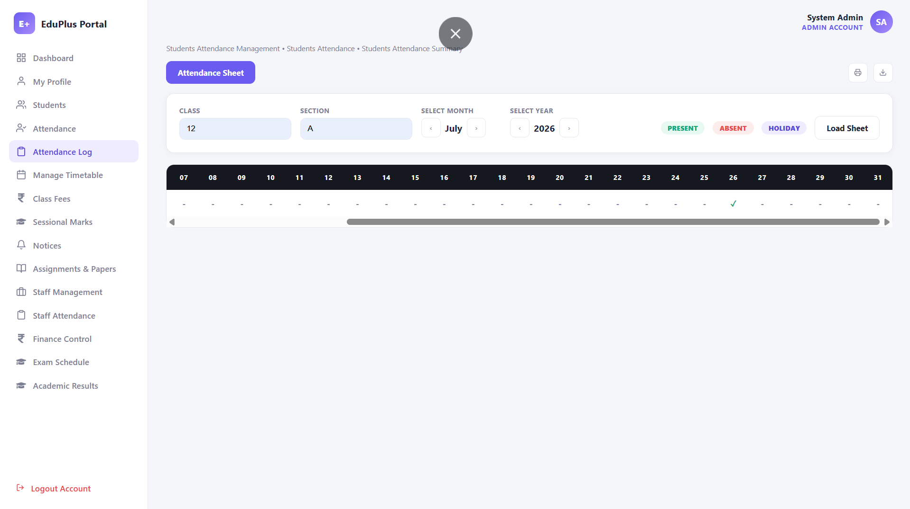
  </a>
</p>

---

## 👨‍🏫 Staff Management

<p align="center">
  <a href="screenshots/staff-management.png">
    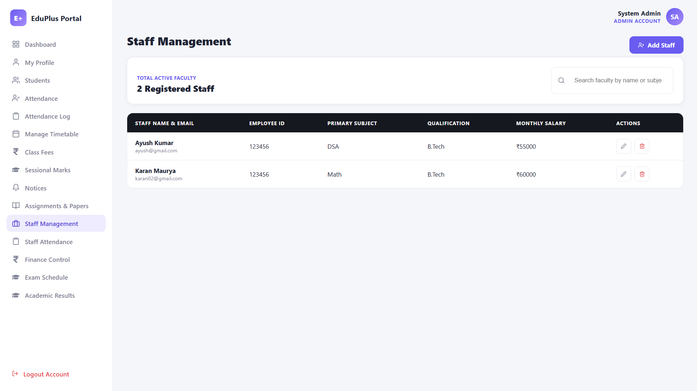
  </a>

  <a href="screenshots/staff-attendance.png">
    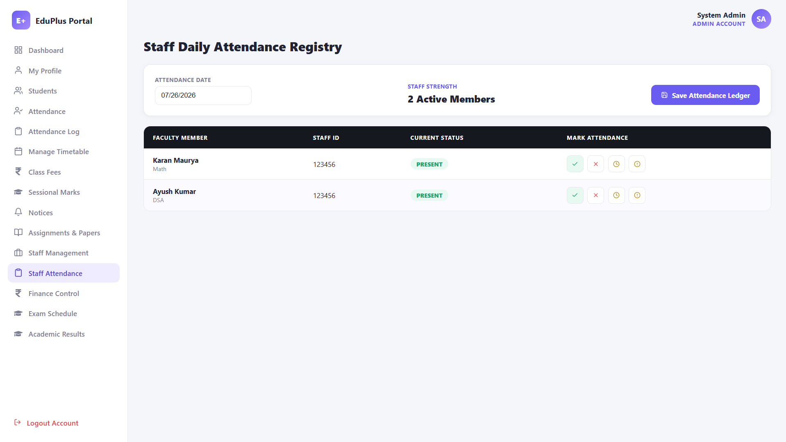
  </a>
</p>

---

## 💰 Fee Management

<p align="center">
  <a href="screenshots/fees.png">
    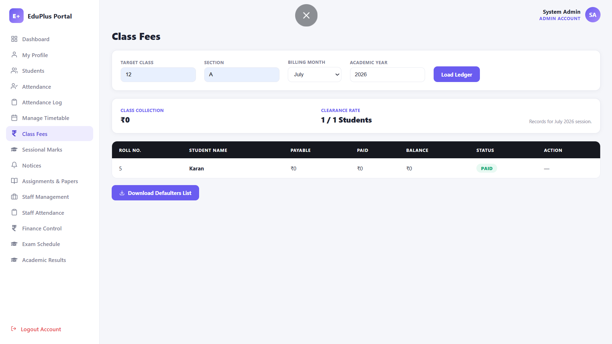
  </a>
</p>

---

## 📖 Timetable Management

<p align="center">
  <a href="screenshots/timetable.png">
    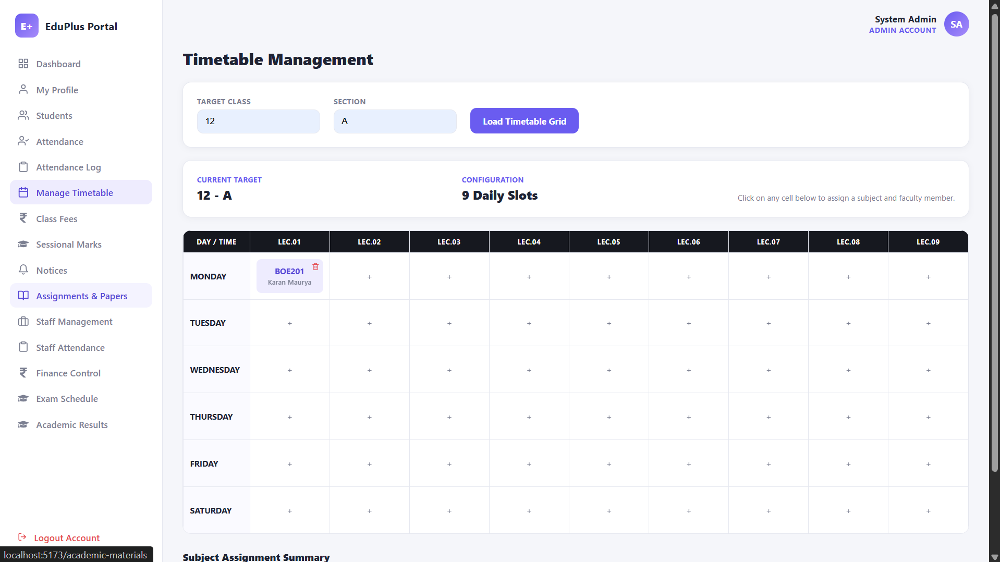
  </a>
</p>

---

## 📝 Academic Management

<p align="center">
  <a href="screenshots/session-marks.png">
    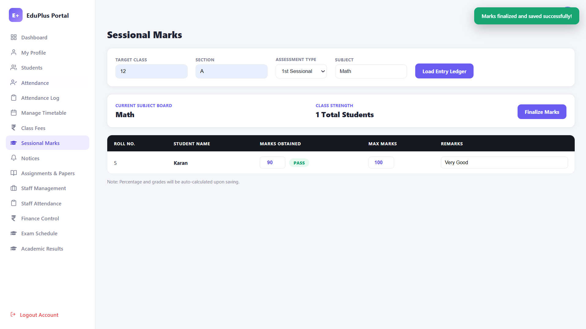
  </a>

  <a href="screenshots/marks.png">
    
  </a>
</p>

<p align="center">
  <a href="screenshots/results.png">
    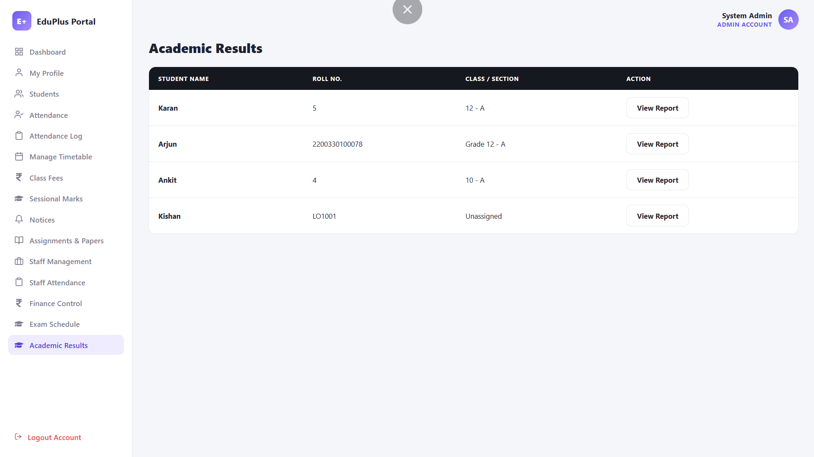
  </a>
</p>

---

## 📚 Study Materials

<p align="center">
  <a href="screenshots/assignment.png">
    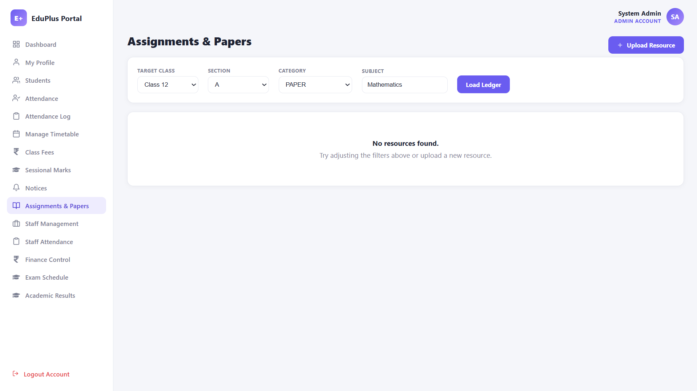
  </a>
</p>

---

## 📝 Examination Module

<p align="center">
  <a href="screenshots/exam-schedule.png">
    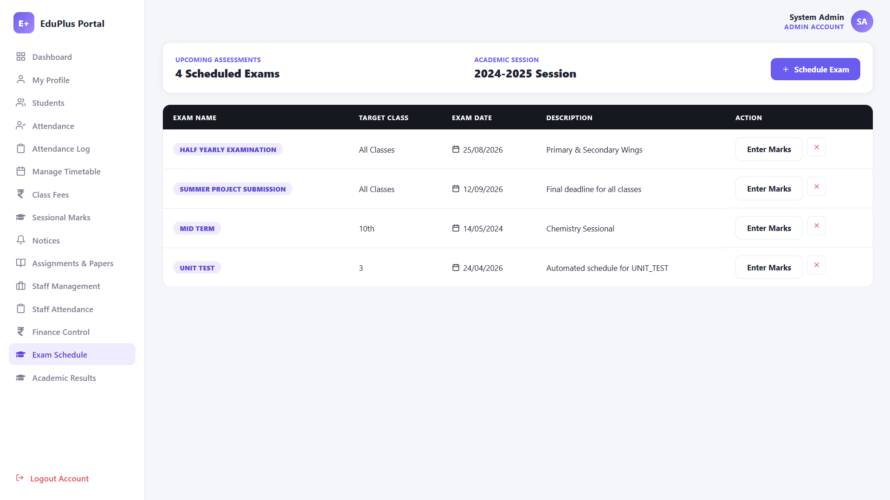
  </a>
</p>

---

## 📢 Notice Board

<p align="center">
  <a href="screenshots/notice-board.png">
    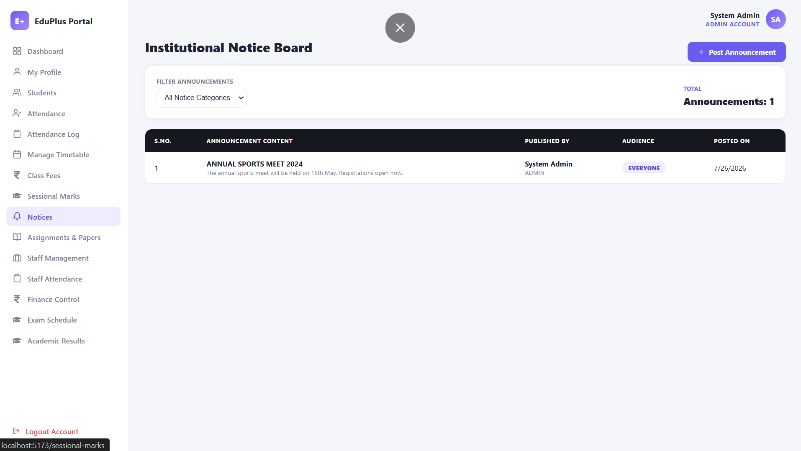
  </a>
</p>

---

## 💹 Finance Control

<p align="center">
  <a href="screenshots/finance.png">
    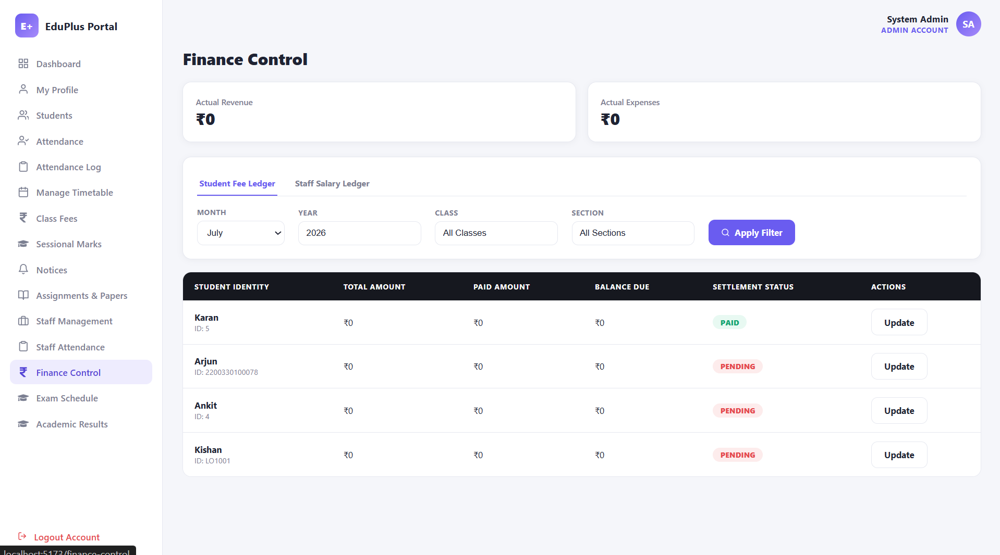
  </a>
</p>

---

# 🛠️ Technology Stack

# 🎨 Frontend

- React 18
- React Router v6
- Axios
- React Icons
- Vite

# ⚙️ Backend

- Node.js
- Express.js
- MongoDB
- Mongoose
- JWT
- bcryptjs

---

# ✨ Features

## Authentication & Authorization

- JWT Authentication
- Password Encryption using bcrypt
- Role Based Login
- Admin Portal
- Teacher Portal
- Student Portal
- Protected Routes
- Profile Management

---

# ✨ Modules

### 📊 Dashboard

- 📈 Dashboard Statistics
- 🏫 School Overview
- 🕒 Recent Activities
- 📅 Event Calendar

---

### 👨‍🎓 Student Management

- ➕ Add Student
- ✏️ Edit Student
- 🗑️ Delete Student
- 📋 Student List
- 👤 Student Profile
- 📁 Student Documents
- 💰 Student Fee History
- 📅 Student Attendance Report
- 📝 Student Academic Report

---

### 👨‍🏫 Teacher & Staff Management

- ➕ Add Staff
- ✏️ Update Staff
- 🗑️ Remove Staff
- 🕒 Staff Attendance
- 👥 Staff Directory

---

### 📅 Attendance Management

#### 👨‍🎓 Student Attendance

- ✅ Daily Attendance
- 📖 Attendance Log
- 📊 Monthly Summary
- 📝 Individual Student Attendance Report

#### 👨‍🏫 Staff Attendance

- 🗂️ Staff Attendance Register
- 📚 Attendance History

---

### 📚 Academic Management

- 🎓 Academic Results
- 📝 Sessional Marks
- 📄 Student Report Card
- 📂 Academic Materials
- 📌 Assignments
- 📖 Study Materials
- 📑 Question Papers

---

### 📝 Examination Module

- ➕ Create Exams
- ✏️ Update Exams
- 🗑️ Delete Exams
- 📅 Exam Schedule

---

### 📖 Timetable Module

- 📅 Weekly Timetable
- 🏫 Lecture Assignment
- 🗂️ Timetable Management

---

### 💰 Fee Management

- 📒 Class Fee Records
- 💳 Student Fee History
- 💵 Payment Updates

---

### 📢 Notice Board

- 📌 Publish Notices
- 🗑️ Delete Notices
- 👀 View Notices

---

### 🎉 Events

- 🎊 School Events
- 🌴 Holiday Calendar
- 📅 Dashboard Calendar

---

### 💹 Finance Control

- 📊 Finance Dashboard
- 💰 Fee Statistics

---

# 👥 User Roles

| Feature | Admin | Teacher | Student |
|----------|:-----:|:-------:|:-------:|
| Dashboard | ✅ | ✅ | ✅ |
| My Profile | ✅ | ✅ | ✅ |
| Students | ✅ | ✅ | ❌ |
| Student Reports | ✅ | ✅ | Own Only |
| Student Documents | ✅ | ✅ | Own Only |
| Attendance | ✅ | ✅ | View Only |
| Attendance Log | ✅ | ✅ | ✅ |
| Timetable | Edit | View | View |
| Class Fees | ✅ | View | ❌ |
| Sessional Marks | Edit | Edit | View |
| Academic Results | ✅ | ✅ | Own Only |
| Academic Materials | ✅ | ✅ | ✅ |
| Notices | Post | Post | View |
| Staff Management | ✅ | ❌ | ❌ |
| Staff Attendance | ✅ | ❌ | ❌ |
| Finance Control | ✅ | ❌ | ❌ |
| Exam Schedule | Manage | View | View |

---

# 📁 Project Structure

```
EduPlus/
│
├── client/
│   │
│   ├── src/
│   │   │
│   │   ├── api/
│   │   │   └── axios.js
│   │   │
│   │   ├── components/
│   │   │   ├── Layout.jsx
│   │   │   ├── ProtectedRoute.jsx
│   │   │   ├── Sidebar.jsx
│   │   │   ├── StudentReportView.jsx
│   │   │   ├── Toast.jsx
│   │   │   └── Topbar.jsx
│   │   │
│   │   ├── context/
│   │   │   └── AuthContext.jsx
│   │   │
│   │   ├── pages/
│   │   │   ├── Dashboard.jsx
│   │   │   ├── Login.jsx
│   │   │   ├── Signup.jsx
│   │   │   ├── Students.jsx
│   │   │   ├── StudentDetail.jsx
│   │   │   ├── StudentProfile.jsx
│   │   │   ├── StudentDocuments.jsx
│   │   │   ├── StudentReport.jsx
│   │   │   ├── StudentFees.jsx
│   │   │   ├── Attendance.jsx
│   │   │   ├── AttendanceLog.jsx
│   │   │   ├── StaffAttendance.jsx
│   │   │   ├── StaffManagement.jsx
│   │   │   ├── ManageTimetable.jsx
│   │   │   ├── ExamSchedule.jsx
│   │   │   ├── AcademicResults.jsx
│   │   │   ├── AcademicMaterials.jsx
│   │   │   ├── SessionalMarks.jsx
│   │   │   ├── ClassFees.jsx
│   │   │   ├── FinanceControl.jsx
│   │   │   ├── Notices.jsx
│   │   │   └── Profile.jsx
│   │   │
│   │   ├── styles/
│   │   │
│   │   ├── App.jsx
│   │   └── main.jsx
│   │
│   ├── .env
│   ├── index.html
│   ├── package.json
│   └── vite.config.js
│
├── server/
│   │
│   ├── config/
│   │   └── db.js
│   │
│   ├── controllers/
│   │   ├── attendanceController.js
│   │   ├── authController.js
│   │   ├── dashboardController.js
│   │   ├── eventController.js
│   │   ├── examController.js
│   │   ├── feeController.js
│   │   ├── marksController.js
│   │   ├── materialController.js
│   │   ├── noticeController.js
│   │   ├── staffAttendanceController.js
│   │   ├── staffController.js
│   │   ├── studentController.js
│   │   └── timetableController.js
│   │
│   ├── middleware/
│   │   └── auth.js
│   │
│   ├── models/
│   │   ├── Attendance.js
│   │   ├── Event.js
│   │   ├── Exam.js
│   │   ├── Fee.js
│   │   ├── Material.js
│   │   ├── Notice.js
│   │   ├── SessionalMark.js
│   │   ├── StaffAttendance.js
│   │   ├── Timetable.js
│   │   └── User.js
│   │
│   ├── routes/
│   │   ├── attendanceRoutes.js
│   │   ├── authRoutes.js
│   │   ├── dashboardRoutes.js
│   │   ├── eventRoutes.js
│   │   ├── examRoutes.js
│   │   ├── feeRoutes.js
│   │   ├── marksRoutes.js
│   │   ├── materialRoutes.js
│   │   ├── noticeRoutes.js
│   │   ├── staffAttendanceRoutes.js
│   │   ├── staffRoutes.js
│   │   ├── studentRoutes.js
│   │   └── timetableRoutes.js
│   │
│   ├── utils/
│   │   └── seed.js
│   │
│   ├── .env
│   ├── package.json
│   └── server.js
│
└── README.md
```

---

# ⚙ Backend Setup

```bash
cd server
npm install
cp .env.example .env
```

Update the `.env` file.

```
PORT=5000

MONGO_URI=mongodb://Mongodb_connection _string_here (local or Atlas)

JWT_SECRET=eduplus_secret_key_here

JWT_EXPIRES_IN=7d

CLIENT_URL=http://localhost:5173
```

Seed Demo Data

```bash
npm run seed
```

Run Backend

```bash
npm run dev
```

or

```bash
npm start
```

Backend URL

```
http://localhost:5000/api
```

---

# ⚙ Frontend Setup

```bash
cd client

npm install

cp .env.example .env

npm run dev
```

Frontend URL

```
http://localhost:5173
```

---

# 🔑 Demo Credentials

## 👨‍💼 Admin

```
Email:
admin@school.com

Password:
admin123
```

---

## 👨‍🏫 Teacher

```
Email:
teacher@gmail.com

Password:
teacher123
```

---

## 🎓 Student

```
Roll Number:
4

Password:
student123
```

---

# 🌐 REST API Overview

Base URL

```
http://localhost:5000/api
```

### 🔐 Authentication

- POST `/auth/register`
- POST `/auth/login`
- GET `/auth/me`
- PUT `/auth/profile`

### 👨‍🎓 Students

- Student CRUD
- Student Profile
- Student Report
- Student Documents
- Student Fees

### 📅 Attendance

- Student Attendance
- Attendance Summary
- Attendance Report

### 👨‍🏫 Staff

- Staff CRUD
- Staff Attendance

### 💰 Fees

- Fee Ledger
- Payment Update

### 📝 Marks

- Sessional Marks
- Student Result

### 📖 Timetable

- Weekly Timetable
- Lecture Assignment

### 📝 Exams

- Exam CRUD

### 📚 Materials

- Assignments
- Study Material

### 📢 Notices

- Notice CRUD

### 🎉 Events

- Event CRUD

### 📊 Dashboard

- Dashboard Statistics

---

### 🔒 Security Features

- JWT Authentication
- Password Hashing using bcrypt
- Protected API Routes
- Role Based Authorization
- Axios JWT Interceptor

---

### 🚀 Future Improvements

- Email Notifications
- SMS Integration
- Parent Portal
- Online Fee Payment
- File Upload Storage (Cloudinary/AWS S3)
- Report PDF Generation
- Analytics Dashboard
- Multi-School Support

---

### 📄 License

This project is licensed under the **MIT License**.

---

### 👨‍💻 Author

**Karan Maurya**

- GitHub: [@karanaurya-git](https://github.com/karanaurya-git)
- LinkedIn: [karan-maurya-4260b6293/](https://linkedin.com/in/karan-maurya-4260b6293/)

If you found this project helpful, don't forget to ⭐ the repository.